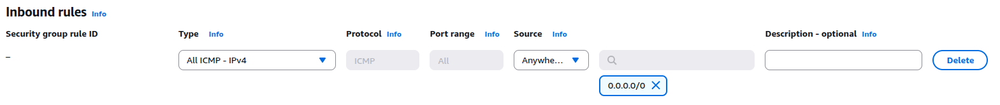

# Project 11: Work with Security Groups

## Objective
Understand how to configure and test EC2 Security Groups by allowing and restricting inbound traffic.

---

## Steps
1. Launch an EC2 instance with a default Security Group.
2. Update the Security Group rules:
   - Allow **SSH (22)** from anywhere (0.0.0.0/0).
   - Allow **HTTP (80)** from anywhere (for web traffic).
   - Restrict SSH to Other IP (instead of 0.0.0.0/0).
   - Test by trying SSH from allowed IP and blocked IP.
   - Add/remove ICMP (ping) rule and test connectivity.
3. Verify:
   - SSH works only from your IP.
   - HTTP works from browser.
   - Ping works only if ICMP rule is added.

---

## Screenshots
- Security Group with SSH allowed from anywhere

- Security Group with HTTP rule added

- Security Group restricted to specific IP

- Ping blocked (ICMP removed)

- Ping allowed (ICMP enabled)

---

## Key Learnings
- How Security Groups act as virtual firewalls
- Rule-based inbound/outbound traffic management
- Importance of limiting SSH access to specific IPs
